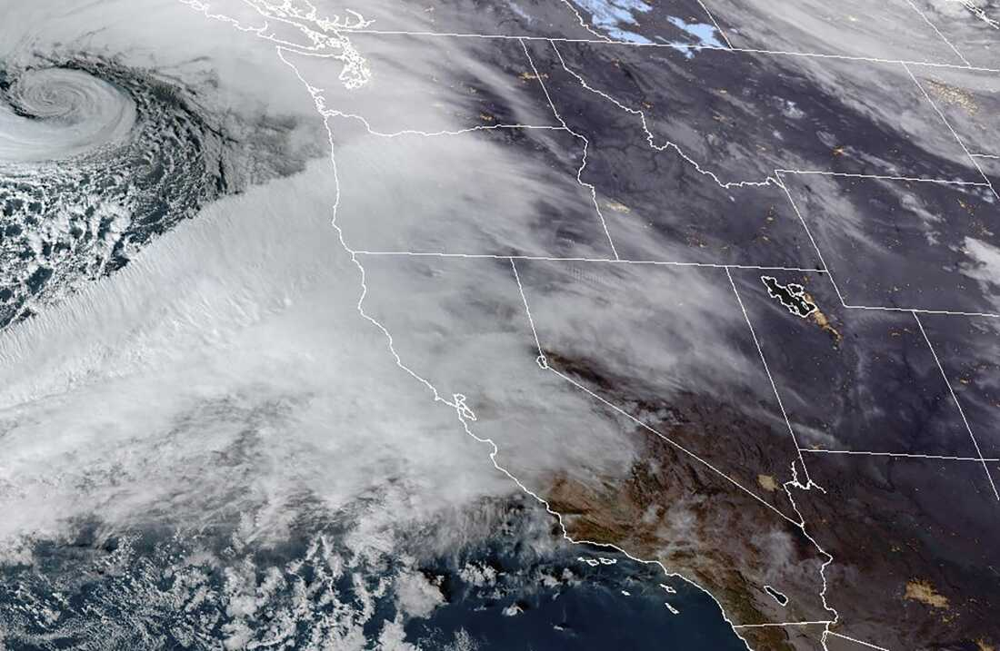

# WHEATHER

This code use openweather is an API KEY about  weather.

I developed this app using React, JavaScript, and the help of AI. The app's function is to search for the weather by the name of a city.

When a city name is entered, the result includes the city name, temperature, humidity, weather condition (sky state), wind, and cloudiness